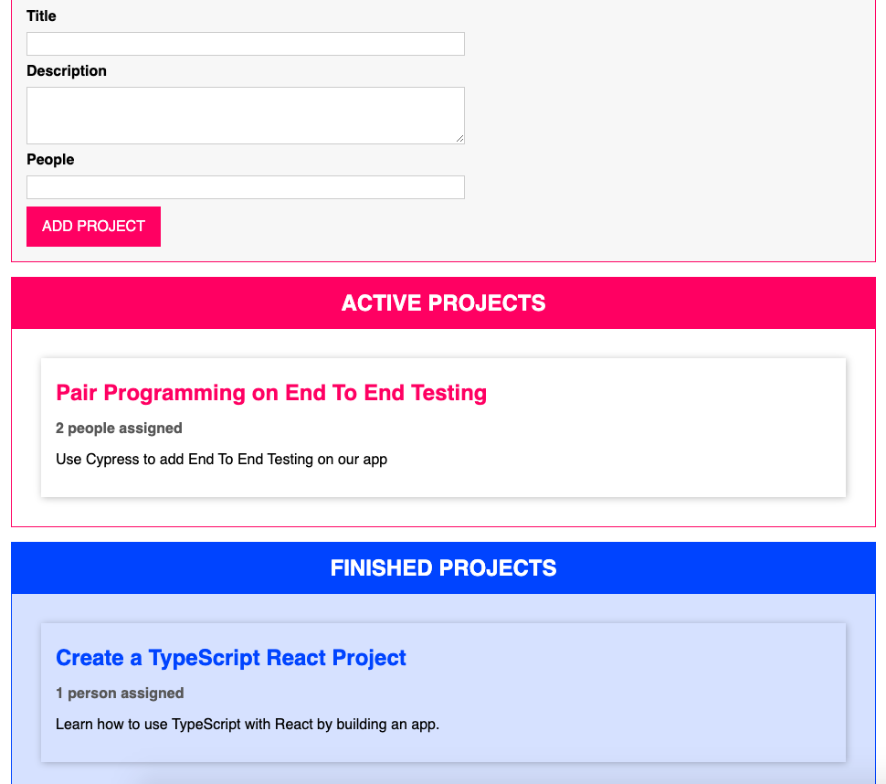

# TypeScript Drag & Drop App

This is a Kanban style project app created using Typescript.
The OOP Approach is implemented using classes.

## Installation:

1. git clone (this repo)

2. npm install

3. npm run start

4. (In 2nd Terminal Tab) tsc -w

## Image:

## Gif:

